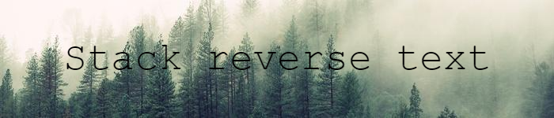

## What project do?
___

Program reads file "data.txt" which contains reversed text. After that program reverse text using stack and writes it to "output.txt".

<!--https://banner.godori.dev/-->
<!--https://shields.io/-->
<!--https://carbon.now.sh/-->